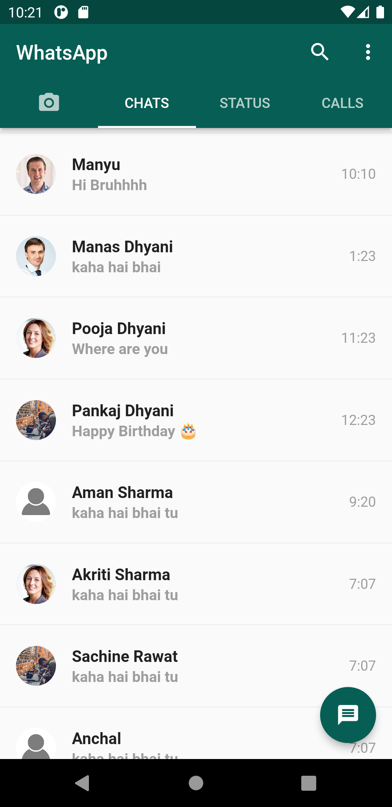
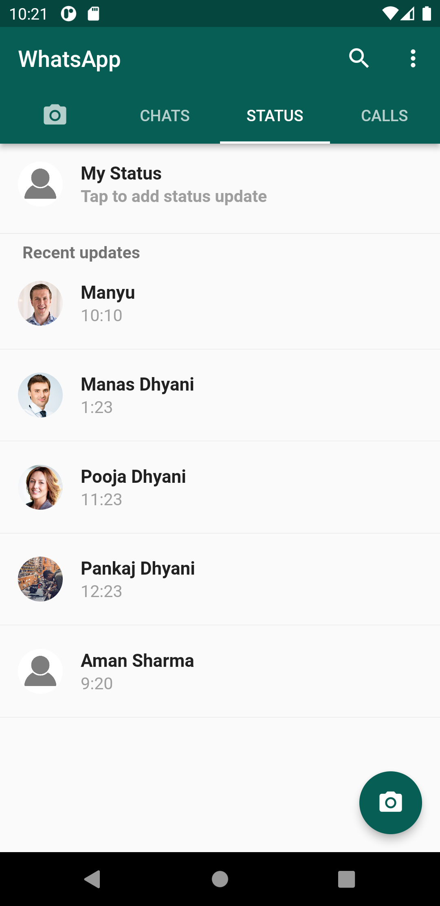
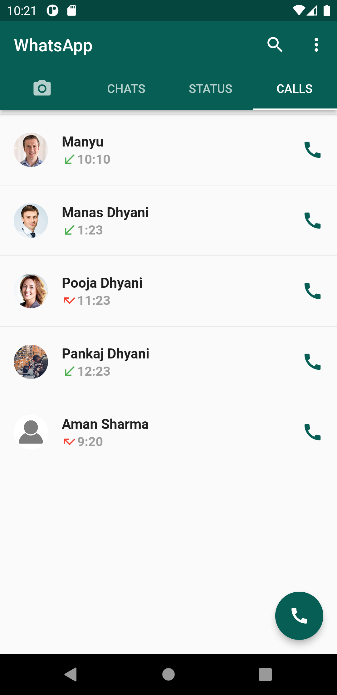
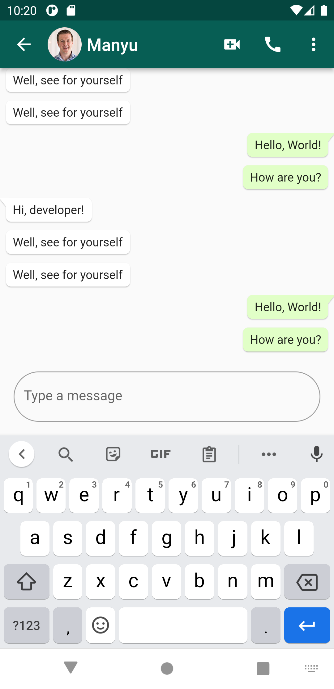

# Whatsapp Clone Flutter

A new Flutter project. Flutter Version used 2.8.1 with dependency: bubble: 1.2.1.

## Overview

This project is a static whatsapp clone (UI).

Chat, Status, and Call Windows respectively.

 &nbsp;   &nbsp; 

Chat Detail Window.

